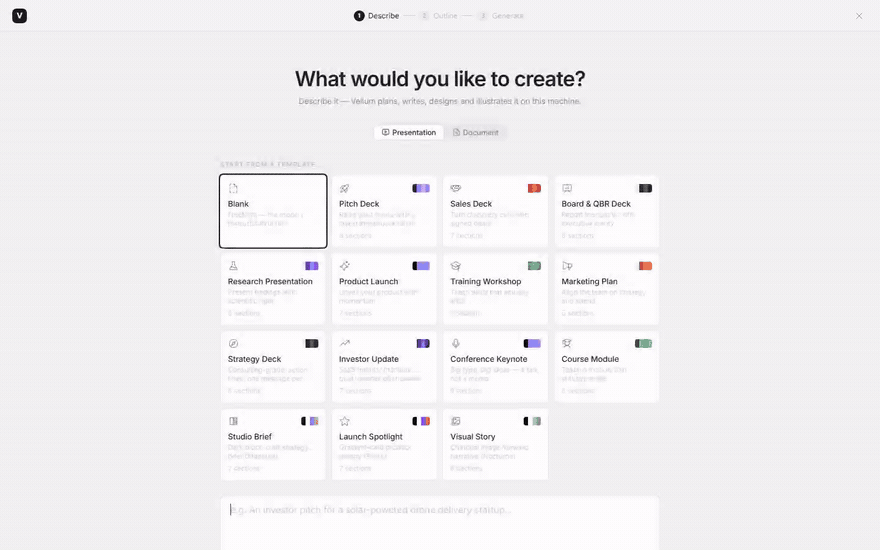
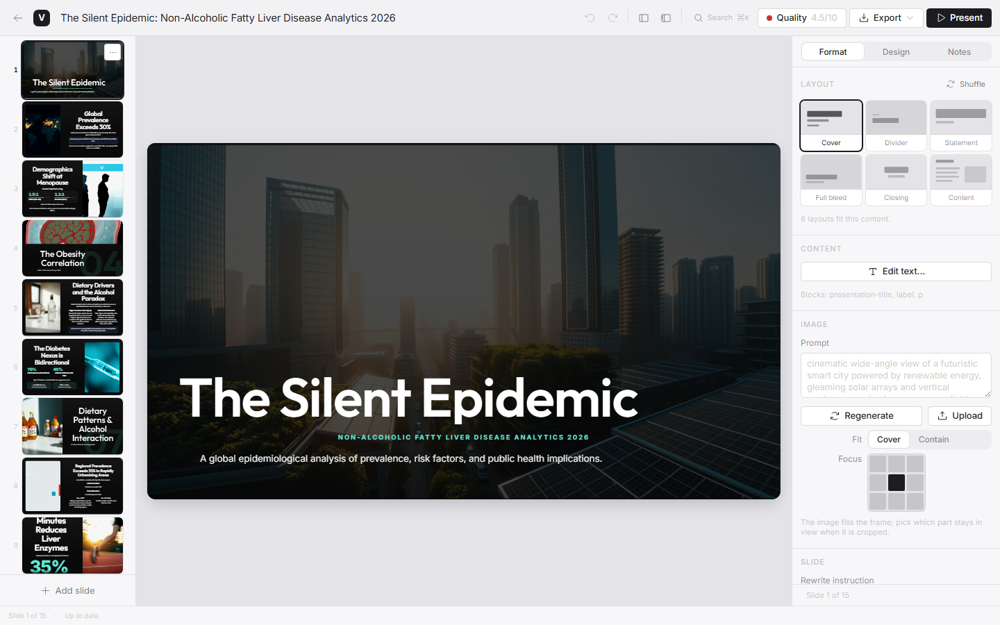
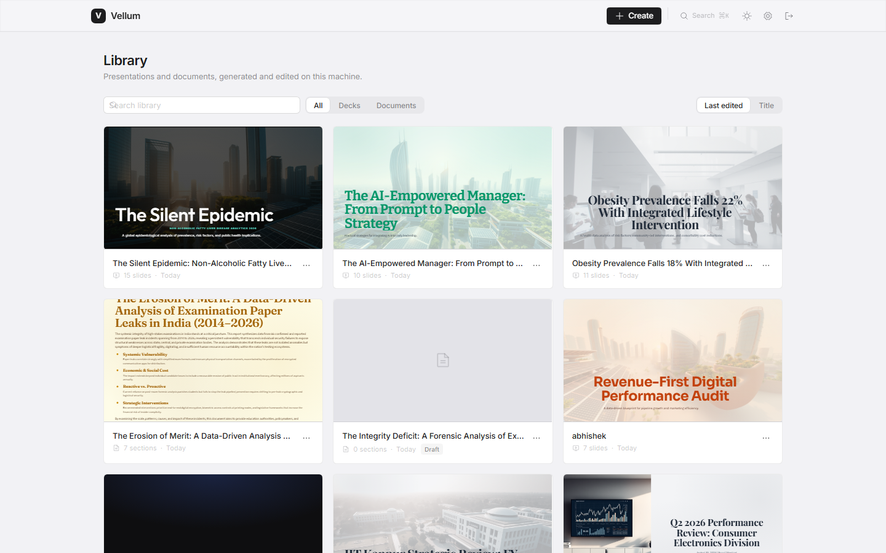
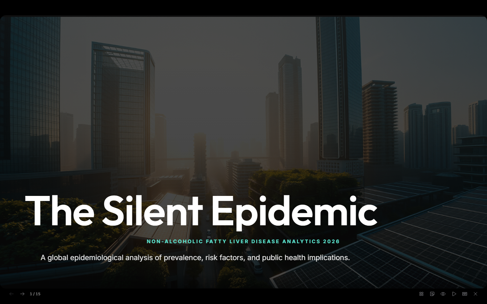
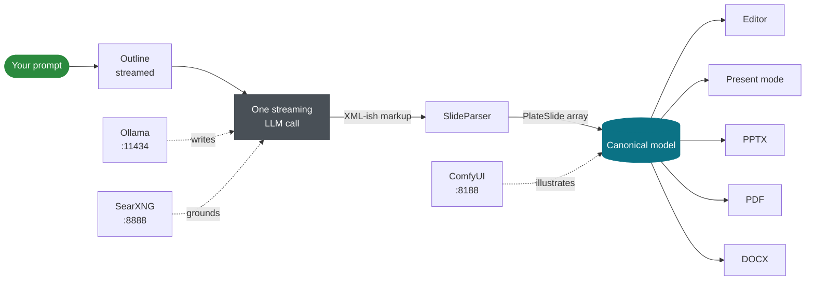

<div align="center">

<h1>Vellum</h1>

**An AI presentation generator that runs entirely on your own machine.**

No cloud APIs. No credits. No subscription. Your prompt, your data and your
client's name never leave the box.




<sub><b>A real, unedited run</b> — prompt to finished six-slide deck. Played at
5×; the actual wall-clock was <b>21s to the outline and under a minute to the
finished deck</b> on the hardware described <a href="#hardware">below</a>. Illustrations keep
streaming in after the text lands, which is why the slides are still plain at
the end of the clip.</sub>

</div>

---

A local LLM writes the content. A local diffusion model illustrates it. A local
search engine grounds it in facts. PowerPoint, PDF and Word exports render
headlessly from the **same canonical model the editor shows** — so what you see
is what ships.

This is finished software in daily use, not a demo: **59 documents** in the
author's library, **187 tests**, `tsc` and `lint` clean.

```powershell
git clone https://github.com/ANVEAI/vellum aai-ppt
cd aai-ppt
powershell -ExecutionPolicy Bypass -File scripts\install.ps1
```

One command: dependencies, database, models, icon index, build, and a server on
<http://localhost:3210>.

---

## Why this exists

Every mainstream AI presentation tool is a hosted service. Your prompt, your
outline, your unreleased figures and your client's name travel to someone
else's infrastructure, get processed by a model you don't control, and are
metered by a credit counter that resets monthly.

For a consultant under NDA, a clinician near patient data, a lawyer, or anyone
inside an air-gapped network, that isn't a pricing objection. It's a
**disqualifier**.

Vellum takes the other path. The model runs on your GPU. The images are
generated on your GPU. The database is a file on your disk. **Pull the network
cable and everything still works.**

There's also permanence. Tome — the tool everyone called the "PowerPoint killer"
in 2024 — announced its pivot in October 2024, sunset the product in March 2025,
and **deleted user decks that hadn't been exported** when it shut down on 30
April 2025.[^tome] A generator that lives on your own disk cannot be sunset out
from under you.

## How it compares

Feature parity isn't the claim. The hosted tools are polished, collaborative and
genuinely good at what they do. The claim is about one axis they all share — and
one they don't.

| | **Vellum** | Gamma | Chronicle | Beautiful.ai | Pitch | presenton |
|---|:---:|:---:|:---:|:---:|:---:|:---:|
| **Content stays on your machine** | ✅ | ❌ | ❌ | ❌ | ❌ | ✅ |
| **Works with no internet at all** | ✅ | ❌ | ❌ | ❌ | ❌ | ✅ |
| **Recurring cost** | **$0** | $12–100/mo | $12–59/user/mo | up to $40/user/mo | $19–29/mo | $0 |
| **Metered by credits/tokens** | never | ✅ | ✅ | — | ✅ | never |
| **Self-hostable** | ✅ | ❌ | ❌ | ❌ | ❌ | ✅ |
| **Source available** | ✅ | ❌ | ❌ | ❌ | ❌ | ✅ |
| **PPTX export** | ✅ | ✅ | ✅ | ✅ | ✅ | ✅ |
| **PDF export** | ✅ | ✅ | ✅ | ✅ | ✅ | ✅ |
| **DOCX / long-form documents** | ✅ | partial | ❌ | ❌ | ❌ | ❌ |
| **Images generated on your GPU** | ✅ | ❌ | ❌ | ❌ | ❌ | ❌ |
| **Research grounding + citations** | ✅ local | ✅ hosted | ✅ hosted | ❌ | ❌ | ❌ |
| **Real-time collaboration** | ❌ | ✅ | ✅ | ✅ | ✅ | ❌ |
| **Publish / share to the web** | ❌ | ✅ | ✅ | ✅ | ✅ | ❌ |
| **Hosted — nothing to install** | ❌ | ✅ | ✅ | ✅ | ✅ | ❌ |
| **SSO / admin controls** | ❌ | ✅ | ✅ | ✅ | ✅ | ❌ |

<sub>Competitor pricing and features as published in <b>August 2026</b>; these
move constantly — check the vendors before relying on them. Sources at the foot
of this file. <code>presenton</code> is here deliberately: it's an open-source,
Ollama-capable, genuinely local peer, and Vellum ported ideas from it.[^attrib]</sub>

**Read the bottom half of that table too.** Vellum has no collaboration, no
share links, no mobile app, no SSO, and you have to install it. If your work is
six people iterating on one deck at once, **buy Gamma** — it is better at that
than Vellum will ever be. If your work must not leave the building, keep reading.

### What it costs over time

Hosted tools charge per seat, per month, forever, and meter generation on top.
Vellum's marginal cost is electricity.

| | Year 1 | Year 3 | Year 5 |
|---|---:|---:|---:|
| Gamma Pro, 1 seat | $300 | $900 | $1,500 |
| Chronicle Plus, 5 seats | $1,500 | $4,500 | $7,500 |
| Beautiful.ai Team, 10 seats | $4,800 | $14,400 | $24,000 |
| **Vellum, unlimited seats** | **$0** | **$0** | **$0** |

<sub>Straight-line from published monthly list prices, August 2026. Ignores
annual discounts — and ignores the hardware, which you have to own.</sub>

---

## What it looks like

<table>
<tr>
<td width="50%"></td>
<td width="50%"></td>
</tr>
<tr>
<td align="center"><sub><b>Editor</b> — layout, image fit and focal point per slide</sub></td>
<td align="center"><sub><b>Library</b> — thumbnailed by the real renderer, not a cache</sub></td>
</tr>
<tr>
<td colspan="2"></td>
</tr>
<tr>
<td colspan="2" align="center"><sub><b>Present mode</b> — full-screen, keyboard-driven</sub></td>
</tr>
</table>

## The design engine

Generation isn't one prompt and a template. The output is *planned*.

| | |
|---|---|
| **7 design families** | `swiss` · `editorial` · `corporate` · `bold` · `organic` · `tech` · `studio` — each decides how slides are **built**, not just coloured |
| **16 slide archetypes** | hero, agenda, divider, statement, quote-full, full-bleed, split, three-up, kpi, chart-focus, closing, team-grid, testimonial, phase-cards, metric-bubbles, content |
| **20 templates** | pitch deck, sales deck, research report, whitepaper, case study, executive one-pager, course, keynote, and more |
| **10 native infographics** | timeline · funnel · pyramid · org-chart · matrix · venn · cycle · roadmap · gauge · comparison — real elements, not flattened images |
| **A FLOW diagram DSL** | describe a diagram in markup; it lays itself out |
| **Cadence planning** | archetypes carry a weight (`breath` / `standard` / `dense`) so a deck breathes instead of hammering |

Slides are typed as `PlateSlide[]` — one canonical model read by the editor,
present mode, the PPTX exporter, the PDF print route and the DOCX writer. There
is no second representation to drift out of sync.

## Architecture



**One streaming call produces an entire deck**, not one call per slide. That's a
deliberate consequence of the hardware: Ollama at a 262144 context runs a single
parallel slot, so per-slide calls would serialise anyway *and* lose cross-slide
coherence.

> [!IMPORTANT]
> **Read [`docs/ARCHITECTURE.md`](docs/ARCHITECTURE.md) before touching
> generation, layout or export.** It documents invariants that look arbitrary
> and aren't — the parser's reset-and-reparse contract, why layout planning is
> backward-looking, why a slide's height must never derive from a measured
> width, the frozen `[data-block-idx]` export contract, and the pptxgenjs
> `options`-vs-`sizing` trap. Each one cost a real debugging session.

---

## Hardware

The honest part. Running the model locally is the whole point, and that means
the model has to fit on hardware you own.

| | |
|---|---|
| **Default text model** | `qwen3.6:35b` — **~24 GB**, needs a 24 GB+ GPU to be comfortable |
| **Embeddings** | `nomic-embed-text` — ~0.3 GB, trivial |
| **Timings above measured on** | 2× NVIDIA H200, Windows Server 2025 |
| **Smaller models** | fully supported — the model is a setting, not a constant |
| **Images (optional)** | ComfyUI + a diffusion model; a separate ~17 GB download and a GPU |
| **No GPU at all?** | Ollama will run on CPU. It will work. It will not be fast. |

The text model is configurable in Settings (`settings.model`). Point it at
`gemma4:e4b` (~9.6 GB) or any other Ollama model if 24 GB isn't available —
you'll trade some coherence on long decks for a much smaller footprint.

> [!NOTE]
> **Setup is Windows-first.** The application itself is ordinary Next.js and
> portable, but the installer and helper scripts are PowerShell. On Linux or
> macOS you'd currently be wiring up `npm ci`, `prisma migrate deploy`,
> `prisma generate` and `next build` by hand.

## Who this is for

**A good fit if** you handle material under NDA, work in a regulated or
air-gapped environment, own a decent GPU already, generate decks often enough
that per-seat pricing stings, or simply want the tool to still exist in three
years.

**A bad fit if** you need real-time co-editing, want to send someone a share
link, work mainly from a phone or tablet, need SSO and audit logs today, or
don't have a GPU and don't want to wait. Those are all real needs. **The hosted
tools serve them better, and you should use one.**

---

## Install

Requires [Node.js](https://nodejs.org) 20+ and [Ollama](https://ollama.com).

```powershell
git clone https://github.com/ANVEAI/vellum aai-ppt
cd aai-ppt
powershell -ExecutionPolicy Bypass -File scripts\install.ps1
```

Installs dependencies, writes `.env` with a generated password and a fresh
64-hex session secret, applies migrations, generates the Prisma client, pulls
the Ollama models, builds the icon search index, builds the app, and starts it
on <http://localhost:3210>. It prints the login password and LAN address when it
finishes. **Re-running is safe** — every step detects whether it's already done.

Fonts are committed, so nothing is fetched from the web during setup beyond npm
packages and the Ollama models.

| Switch | Effect |
|---|---|
| `-Password "..."` | set the login password instead of generating one |
| `-RestoreFrom lib.zip` | restore an existing library |
| `-SkipModels` | skip the Ollama pull (about 23 GB) |
| `-NoStart` | set up without building or launching |
| `-Force` | rewrite `.env` / reinstall dependencies |

Day to day:

```powershell
powershell -ExecutionPolicy Bypass -File vellum\scripts\start-all.ps1
```

Keep it up across reboots and crashes:

```powershell
powershell -ExecutionPolicy Bypass -File scripts\vellum-autostart.ps1 -Register
```

### Services

| Port | Service | Required? | Without it |
|---|---|---|---|
| 3210 | **Vellum** | — | — |
| 11434 | **Ollama** — `qwen3.6:35b` + `nomic-embed-text` | **yes** | nothing generates |
| 8188 | ComfyUI — FLUX.1-schnell / Qwen-Image / HiDream | optional | slides render without images |
| 8888 | SearXNG | optional | written from model knowledge, no citations |

`scripts/setup-dependencies.ps1` clones the optional companions on request
(`-Images`, `-Research`). Run it with no arguments and it lists the options and
their sizes **without downloading anything**. Clones are `--depth 1`; ComfyUI's
model weights are a separate ~17 GB opt-in via `vellum/scripts/setup-comfyui.ps1`.

### Moving your library between machines

Decks, generated images and the icon index live under `vellum/data/`, which is
not in git. Stop the app, then:

```powershell
powershell -ExecutionPolicy Bypass -File scripts\data-snapshot.ps1 -Mode export -Path C:\vellum-library.zip
```

Hand the zip to the installer on the new machine with `-RestoreFrom`. The
snapshot **reopens the archive and verifies it** after packing — it fails loudly
rather than producing an archive full of images with no database in it.

---

## Verification

Nothing here is aspirational. All of it runs.

```powershell
cd vellum
npm test                                       # 187 tests
npx tsc --noEmit
npm run lint
npx tsx scripts\ui-check.ts <deckId> <docId>   # 48 screenshots, a11y, menus
npx tsx scripts\e2e-create.ts                  # real generation, zero re-layouts
npx tsx scripts\e2e-export.ts <deckId>         # PDF + a real browser download
npx tsx scripts\export-parity.ts <deckId>      # no stretched images in the PPTX
npx tsx scripts\verify-export-contract.ts <deckId>
npx tsx scripts\nav-stability.ts <deckId>      # the 8/9/10 slide boundary
```

`ui-check.ts` isn't a smoke test — it fails on console errors, overflow,
unlabelled controls, unreachable menu items, missing focus rings and
under-sized hit targets, across two themes and four viewport widths.
**Accessibility is enforced, not aspired to.**

## FAQ

<details>
<summary><b>Why not just use Gamma? It's better looking and I don't have to install anything.</b></summary><br>

Often you should. Gamma is excellent, and if your content isn't sensitive and
you like the hosted workflow, Vellum has little to offer you. The argument for
Vellum is narrow and specific: your material cannot leave your machine, or you
refuse to rent access to your own tooling forever.
</details>

<details>
<summary><b>Is a 35B local model actually good enough for real decks?</b></summary><br>

For structured business and research content, yes — the 59 documents in the
author's library are real work. Where it's weaker than a frontier hosted model
is long-range narrative subtlety and unusual domains. The design engine carries
a lot of the quality: the model supplies content, and the planner decides
archetype, cadence and layout deterministically.
</details>

<details>
<summary><b>Does it phone home? At all?</b></summary><br>

No. Setup downloads npm packages and Ollama models; after that nothing contacts
the network except the services you run yourself. SearXNG queries the web
because that is its job, and it's optional and off unless you enable research.
</details>

<details>
<summary><b>Can I run it on Linux?</b></summary><br>

The app is ordinary Next.js and portable. The installer and helper scripts are
PowerShell, so you'd currently do setup by hand. A POSIX installer is an
obvious contribution.
</details>

<details>
<summary><b>How editable are the exports, really?</b></summary><br>

PPTX comes out as real shapes and text boxes, positioned from the same geometry
the browser renders, with images cover-cropped rather than stretched — verified
byte-level by <code>export-parity.ts</code>. Two known limits: PowerPoint's text
engine wraps differently to a browser, so line breaks can differ while box
geometry and font sizes match; and annotated charts export as 192-DPI images
rather than native editable charts.
</details>

## Repository map

| Path | What it is |
|---|---|
| [`HANDOFF.md`](HANDOFF.md) | Full context in one file — **start here** |
| [`docs/ARCHITECTURE.md`](docs/ARCHITECTURE.md) | The load-bearing invariants |
| [`docs/p6-hardening-report.md`](docs/p6-hardening-report.md) | The last hardening pass, with root causes and numbers |
| [`vellum/`](vellum/) | The application — Next.js 15, TypeScript, SQLite/Prisma |
| `scripts/` | `install.ps1`, `data-snapshot.ps1`, `vellum-autostart.ps1` |
| `searxng_config/` | Local SearXNG settings |

## Security

Authentication is **a single shared password over plain HTTP**, designed for a
machine you control on a network you trust.

> [!WARNING]
> Don't port-forward this to the internet. Put it behind a TLS reverse proxy
> with real authentication first.

## Licensing and attribution

Vellum ports ideas and code from two open-source projects, neither of which it
depends on at runtime: [presenton](https://github.com/presenton/presenton)
(Apache-2.0) and
[presentation-ai](https://github.com/allweonedev/presentation-ai) (MIT). Full
attribution is in
[`vellum/THIRD_PARTY_LICENSES.md`](vellum/THIRD_PARTY_LICENSES.md).

Optional companions carry their own licences: ComfyUI is GPL-3.0, SearXNG is
AGPL-3.0. Neither is vendored here.

[^tome]: Tome announced its pivot away from presentations in October 2024,
confirmed the sunset in March 2025, and shut the product down on 30 April 2025;
decks that had not been exported were deleted. The team now builds an AI CRM.

[^attrib]: See `vellum/THIRD_PARTY_LICENSES.md`. Including a direct competitor
in one's own comparison table is unusual; omitting the one tool that shares
Vellum's core property would have made the table dishonest.

---

<div align="center">
<sub>

**Sources for the comparison** (retrieved August 2026) ·
[Gamma pricing](https://www.eesel.ai/blog/gamma-pricing) ·
[Chronicle pricing](https://www.saasworthy.com/product/chronicle-hq/pricing) ·
[Beautiful.ai / Pitch comparison](https://2slides.com/blog/ai-presentation-maker-pricing-comparison-2026) ·
[Tome shutdown](https://deckary.com/blog/tome-review) ·
[presenton](https://github.com/presenton/presenton)

</sub>
</div>
